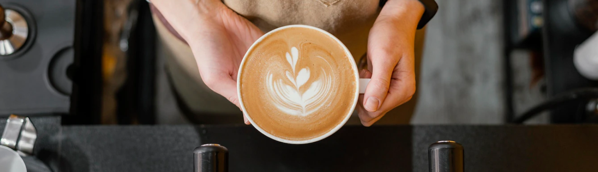

# Projeto 4

# Show
---------------------------- Um preview da Página ---------------------------------

by @ Pricila - https://github.com/pripc

# Projeto 4:

Baseado nas orientações do pdf:

 <embed src="assets/docs/inst_projeto_4.pdf" type="application/pdf" width="100" height="100">

# Usando o bootStrap

 (https://getbootstrap.com/)

# Bora lá: 

1 --------Menu de navegação - navbar ---------------------

 <nav class="navbar navbar-expand-lg bg-body-tertiary">
        

            
            <a class="navbar-brand" href="#">DNC Coffee</a>
            <button class="navbar-toggler" type="button" data-bs-toggle="collapse" data-bs-target="#navbarNav"
                aria-controls="navbarNav" aria-expanded="false" aria-label="Toggle navigation">
                
            </button>
            

                <ul class="navbar-nav">
                    <li class="nav-item">
                        <a class="nav-link active" aria-current="page" href="#">Home</a>
                    </li>
                    <li class="nav-item">
                        <a class="nav-link" data-bs-toggle="modal" data-bs-target="#meuModal" href="#">Sobre</a>
                    </li>
                    <li class="nav-item">
                        <a class="nav-link" data-bs-toggle="modal" data-bs-target="#atendimentoCard" href="#">Atendimento</a>
                    </li>
                </ul>
            

        

        <a href="#" class="btn btn-outline-success rounded-pill" style="width: 10rem"> Fazer Pedido </a>
    </nav>

1.1 Observação:
    O uso do  <a herf ="https://getbootstrap.com/docs/5.0/components/collapse/"> data-bs-toggle e do data-bs-target </a>

2 ------------ Main e sessões ----------------------------------------------
<main>
        <section class="container-fluid p-0">
            
        </section>
        <section class="card-group position-relative">
            

                
                

                    

                        Nossa loja de café se encontra em um lugar, 100% fictício, porém
                        caso se sinta interessado pode vir tomar um café conosco em nossa
                        sede em São José dos Campos.
                    

                    

                        <button id="cardUm" class="btnescondido btn btn-dark w-50 m-0"
                            style="background-color:#2A3342">Comprar agora</button>
                    

                

            

            

                
                

                    

                        Nossa casa de café é a melhor da região, aqui você tem tudo que
                        precisa, uma boa conversar, bons amigos e um ambiente sem igual.
                        Aproveite, pois Melhor que a DNC não existe!
                    

                    

                        <button id="cardDois" class="btnescondido btn btn-dark w-50 m-0"
                            style="background-color:#2A3342">Comprar agora</button>
                    

                

            

            

                
                

                    

                        Por que a DNC? Porque podem contar sempre com um serviço genuíno,
                        uma atmosfera acolhedora e uma incrível xícara de café, torrado
                        por especialistas e preparado de forma enriquecedora.
                    

                    

                        <button id="cardTres" class="btnescondido btn btn-dark w-50 m-0"
                            style="background-color:#2A3342">Comprar agora</button>
                    

                

            

            

                
                

                    

                        A escola especialista em formar talentos, com foco em
                        empregabilidade, migração de carreira e aumento de performance.
                    

                    

                        <button id="cardQuatro" class="btnescondido btn btn-dark w-50 m-0"
                            style="background-color:#2A3342">Comprar agora</button>
                    

                

            

        </section>
 </main>
3 ---------------------- Modais ------------------------
3.1 Modal 1 --------------------------------------------
    

        

            

                

                    <button type="button" class="m-2 btn btn-close flex-shrink-1" data-bs-dismiss="modal"></button>
                

                

                    <h1 class="m-1">Quem somos nós?</h1>
                    

                        <h5>
                            Tudo o que fazemos procura respeitar essa conexão,
                            desde nosso compromisso com o café de melhor qualidade do
                            mundo até a forma como nós interagimos com nossos clientes e
                            nossas comunidades para conduzir nosso negócio de modo responsável.
                        </h5>
                        
                    

                

            

3.2 Modal 2 --------------------------------------------
        

    

    

        

            

                

                    <button type="button" class="m-2 btn btn-close flex-shrink-1" data-bs-dismiss="modal"></button>
                

                <h1 class="mb-2 mt-2">Atendimento</h1>
                
Rua José Alencar, 111, Centro

                
CEP:12209-000 | +55 (11) 3333-8000

                <!-- Unica forma que eu consegui para centralicar o botão -->
                

                    <button type="button" class=" btn btn-primary border-0 ps-3 pe-3 pb-2 pt-2 w-50 "
                        style="background-color:#2A3342; color:white">Entrar em contato</button>
                

            

        

    

4------------ O Jabá ------------------------------------
Não pode faltar o Jabá!
    <footer class="py-5 my-5">
        
 © Eduardo "The Dangerous!"

    </footer>
